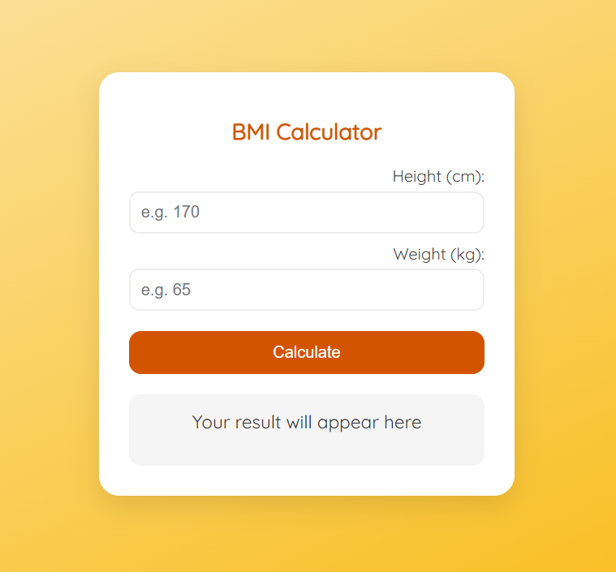

# 🧮 BMI Calculator

A simple and elegant Body Mass Index (BMI) calculator built using **HTML, CSS, and JavaScript**.

---

## 🚀 Features

- Enter your height and weight
- Calculate BMI instantly
- Styled feedback based on BMI result:
  - Underweight
  - Normal
  - Overweight
  - Obese
- Clean and modern UI using **Quicksand** font

---

## 🖼️ Preview

---

## 🛠️ Technologies Used

- HTML5
- CSS3
- JavaScript (Vanilla)
- Google Fonts (Quicksand)

---

## 📁 How to Use

1. Clone or download the repo
2. Open `index.html` in your browser
3. Enter your height (cm) and weight (kg)
4. Click **Calculate BMI**
5. See your result instantly with colored status

---

## 🌐 Live Demo

> 💡 Add link here later if you deploy it on GitHub Pages

---

## 📦 Author

Made with ❤️ by **Abdelwahab Ahmed**
